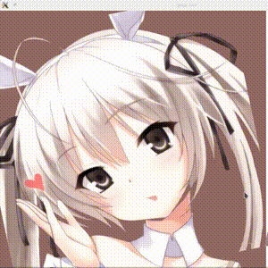

# qml-AvatarShaker
Shake your avatar!
* Left click to change the origin of layer 1

* Right click to change the origin of layer 2

* Slide horizontally to change the shake amplitude of layer 1

* Slide vertically to change shake amplitude of layer 2

On parameter settled, a series of image grab saved to /tmp/Shaker_*.ppm, by default 30 frames in 1 second.

To get an gif, try `convert Shaker_*.ppm Shaker.gif`

